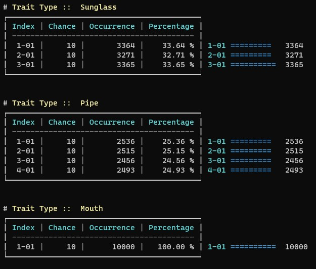

## CRYPT-CHEF NFT - All in one NFT Toolbox

## Features

- **Support to have multiple projects**
- **Init project from layers**
  - config.json 
      1. Layer order configuration
      2. Format asset size
      3.  Base URI
      4. Forcecombination
      5. Incompatible Traits
      6. Default Layer order configuration included

- **Generate project**
    - Base on configuration file
    - Support for multiple workers
    - Check all required details at the start
      - Layers
      - Traits
      - Possible Unique asset count
    
- **Get Rarity Table**
    
- **Get Summary**
    - Number of layers
    - Number of Traits
    - Number of Uniques assets
    - Total collection size
  

## How to use

### Initialize Project 
### Export Collection
- #### New Collection
- #### Regenerate
### View Collection Summary
### View Rarity Table

